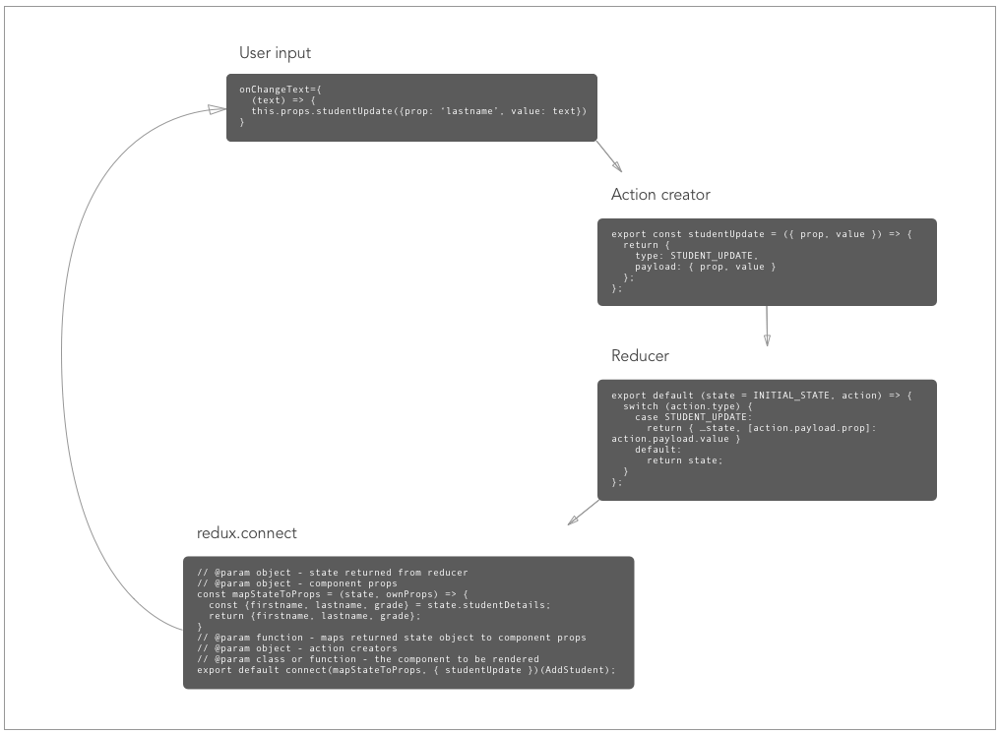

# react-native-prototypes


## Navigation
This uses [react-native-router-flux](https://github.com/aksonov/react-native-router-flux), a router library that plays nice with redux and uses the React Native Nagivator component.

## Roadmap
- [ ] Network requests - these will occur within action creators, as per redux convention, and live in their own directory. This will allow us to remove or swap out the network layer without changing anything on the component layer.
- [ ] Login views and auth - authenticate via FAS, get real user data to start working with

## Component example
Let's break this component down a bit
``` JavaScript
// ES6 module imports from npm modules
import React from 'react';
import { View } from 'react-native';
import { FormInput, FormLabel, Button } from 'react-native-elements';

class AddStudent extends Component {
  render() {
    return (
      <View style={{ paddingTop: 40 }}>
        <FormLabel>Firstname</FormLabel>
        <FormInput
          value={this.props.firstname}
          // Firing studentUpdate action on user input event
          onChangeText={text => this.props.studentUpdate({prop: 'firstname', value: text})}
        />
        <FormLabel>Lastname</FormLabel>
        <FormInput
          value={this.props.lastname}
          // Firing studentUpdate action on user input event
          onChangeText={text => this.props.studentUpdate({prop: 'lastname', value: text})}
        />
        <Button
          small
          backgroundColor='#03A9F4'
          buttonStyle={{borderRadius: 0, marginTop: 20}}
          title='SAVE STUDENT'
        />
      </View>
    );
  }
};
```
First we create a new class called AddStudent, which extends React's Component class. Class-based components must have a render method, which returns JSX elements to be parsed into HTML and rendered into the DOM. Some of these JSX elements are part of the react-native library, some are part of a ui kit I'm using. `<View>` is a ubiquitous react-native component, while `FormLabel`, `FormInput`, and `Button` are pre-styled components provided by `react-native-elements` library. When we move forward with a production app, we'll likely make our own group of pre-style components like this, to be reused throughout the app.
So JSX elements are representations of components. For example, we could import and use `AddStudent` in any other component. Components are passed various props of different data types, some expect objects, some expect functions, etc, depending on the component signature. The `style` prop expects an object of css rules.

## Controlled components
Let's pull this out from the JSX and take a closer look:
```
<FormInput
  value={this.props.firstname}
  // Firing studentUpdate action on user input event
  onChangeText={text => this.props.studentUpdate({prop: 'firstname', value: text})}
/>
```
This is what's happening:
User Input -> Fires action creator, `studentUpdate` -> Action creator sends an object to a reducer -> Reducer ingests the action and returns new state -> new state is set as the form value.



So the text appearing in the input is actually a piece of state, being actively set as a user types. This is a good conceptual pattern for 2-way binding. Everything a user does is ingested by an action, then a reducer, and state is returned to the components.
